**[domingoberbel.com](https://domingoberbel.com)** · [LinkedIn](https://linkedin.com/in/domingo-berbel) · [info@domingoberbel.com](mailto:info@domingoberbel.com)

 

**`> whoami`**

<table>
<tr>
<td width="420"></td>
<td width="420"></td>
</tr>
</table>

 

 

 

 

*Generado con Python — `python -m scripts.build_all`. El heatmap se refresca a diario.*

